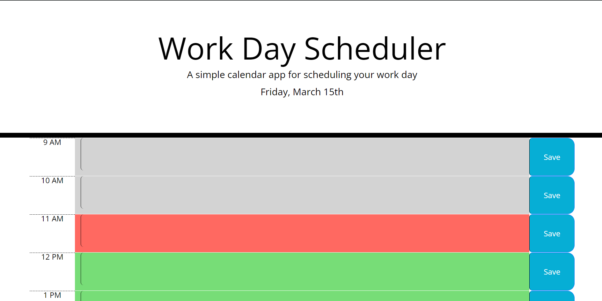

# Planner App

## Description

The Daily Planner App is a simple yet powerful tool to organize your day effectively. With an intuitive interface, it allows users to plan their daily tasks and events conveniently.

## Features

- Time Blocking: Plan your day hour by hour with customizable time blocks.
- Dynamic Styling: Time blocks are color-coded based on past, present, and future times, providing visual cues for better time management.
- Auto-Save: Your events are automatically saved locally.

## Deployed application

[Link to deployed application](https://adam-deb.github.io/planner-app/)

## Screenshot

Here is a screenshot of the deployed application

## Installation

N/A

## Credits

N/A